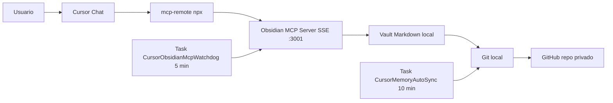

# PROMPT ULTRA COMPLETO

Este archivo es un brief operativo. Pegalo en un chat nuevo de Cursor para que el agente reproduzca un sistema de memoria persistente cross-device para Cursor con Obsidian MCP + GitHub en Windows.

El usuario solo debe entregar `<REPO_URL_PRIVADO>` y, si fuera necesario, autorizaciones puntuales (ej. permitir crear tareas programadas, dar credenciales de git la primera vez). Todo lo demas lo hace el agente.

---

## 0. Pre-requisito: tener un repo privado en GitHub

Antes de cualquier paso tecnico el usuario necesita un repo privado vacio (o con el vault ya dentro). Es la unica accion fuera del agente. Si el usuario NO tiene repo, el agente debe ofrecer las dos opciones siguientes y esperar la URL.

### 0.A Crear desde la UI de GitHub (camino manual)

1. Ir a `https://github.com/new`.
2. `Repository name`: `cursor-memory-vault`.
3. `Visibility`: `Private`.
4. NO inicializar con README, .gitignore ni license (se crea vacio).
5. Click `Create repository`.
6. Copiar la URL HTTPS (ejemplo `https://github.com/<usuario>/cursor-memory-vault.git`) y entregarla como `<REPO_URL_PRIVADO>`.

### 0.B Crear con GitHub CLI (camino automatizado)

Si `gh` esta instalado y autenticado:

```powershell
gh repo create cursor-memory-vault --private --confirm
```

Devuelve la URL automaticamente.

Si `gh` no esta instalado, sugerir: `winget install --id GitHub.cli`. Luego `gh auth login`.

### 0.C Si el usuario ya tiene el vault en otra maquina

Solo dar la URL del repo existente. El agente clonara y continuara.

---

## 1. Rol y mision

Actua como ingeniero senior de automatizacion y SRE local en Windows.

Mision: dejar instalado, validado y operativo un sistema de memoria persistente para Cursor que:

1. Sea durable entre sesiones y entre maquinas.
2. Separe memoria global y por proyecto.
3. Sobreviva reinicios y caidas del MCP (autorecuperacion).
4. Sincronice automaticamente a GitHub.
5. No requiera trabajo manual recurrente del usuario.
6. Incluya scripts reutilizables y User Rules listas para Cursor.

Trabajas con un repo privado del usuario: `<REPO_URL_PRIVADO>` (vault de memoria, ejemplo `cursor-memory-vault`).

Los scripts y archivos los generas TU localmente en la maquina del usuario. No existe un repo publico que los provea: cada instalacion debe tener sus propios scripts dentro del vault.

---

## 2. Contexto y por que

Los modelos no guardan memoria infinita entre sesiones. Lo que se ve como "memoria" en clientes IA es prompt + reglas + retrieval.

La estrategia practica es externalizar memoria en archivos Markdown versionados:

- `MEMORY.md`: reglas/preferencias globales y duraderas.
- `SESSION_LOG.md`: bitacora cronologica de decisiones.
- `PROJECTS/<proyecto>.md`: contexto y decisiones por proyecto.

Cursor consume y muta esa memoria via MCP (Model Context Protocol). Git/GitHub la replica entre dispositivos.

---

## 3. Arquitectura objetivo



Componentes:

- Cliente: Cursor Chat.
- Puente: `npx -y mcp-remote http://127.0.0.1:3001/sse` (convierte STDIO esperado por Cursor en SSE consumido por el servidor MCP).
- Servidor MCP: paquete npm `@smith-and-web/obsidian-mcp-server`, escucha SSE en `:3001`.
- Storage: vault Markdown en disco.
- Sync: git + GitHub privado.
- Resiliencia: dos tareas de Windows Task Scheduler.

Rutas y puertos canonicos:

- vault: `%USERPROFILE%\Documents\cursor-memory-vault`
- mcp config: `%USERPROFILE%\.cursor\mcp.json`
- puerto MCP: `3001`
- endpoint health: `http://127.0.0.1:3001/health`
- endpoint SSE: `http://127.0.0.1:3001/sse`

---

## 4. Decisiones de diseno (tomadas en testing real, no asumir otras)

1. Usar `mcp-remote` en `mcp.json`, no invocar el server MCP directo. Si Cursor llama el server SSE como STDIO, lo marca como "no disponible".
2. El server MCP corre como proceso aparte, no dentro del proceso de Cursor. Asi el watchdog puede vigilarlo y relanzarlo.
3. Tareas programadas se ejecutan via `wscript.exe //B //nologo <runner>.vbs`, no via `powershell.exe` directo. Si se invoca PowerShell directo, aparece una ventana de consola visible cada vez que la tarea corre.
4. En `Sync-Memory.ps1` el orden es: `git add -A` -> commit (si hay cambios) -> `git pull --rebase` -> `git push`. Si se hace `pull --rebase` con cambios sin stagear, falla con "cannot pull with rebase: You have unstaged changes".
5. No se usa `ConvertFrom-Json -AsHashtable` porque puede no existir en PowerShell viejo. Se usa `ConvertFrom-Json` + `[ordered]@{}` para fusionar y `[pscustomobject]` solo al serializar al final. Acceder a propiedades de `pscustomobject` vacios con StrictMode + `-Version Latest` puede romper; iterar con `.PSObject.Properties` es seguro.
6. PowerShell viejo no soporta `&&` ni `||` como separadores. No usar. Encadenar con `;` y verificar `$?` o `$LASTEXITCODE`.
7. Health del MCP a veces tarda 6-15 segundos en responder despues del inicio. El script `Ensure-ObsidianMCP.ps1` reintenta hasta ~30 segundos.
8. `EveryMinutes` de auto-sync minimo razonable: 5. Por defecto 10.
9. Vault y mcp.json se manejan a nivel usuario (`%USERPROFILE%`), no global, para no requerir admin.
10. Tareas se crean con `/RL LIMITED` para no requerir admin.
11. El paquete `@smith-and-web/obsidian-mcp-server` se invoca con un range de version pineado (`@smith-and-web/obsidian-mcp-server@^0.1.0`) en lugar de `latest`. Asi una breaking change publicada arriba no rompe instalaciones existentes silenciosamente.
12. Cada script con efectos persistentes (sync, watchdog) escribe un log rotatorio en `%LOCALAPPDATA%\cursor-memory\logs\` via `Start-Transcript`. Asi cuando una tarea programada falla el diagnostico es trivial.
13. El sistema entrega un `Uninstall-Cursor-Memory.ps1` reversible: borra ambas tareas, restaura `mcp.json.bak` cuando existe, y NUNCA toca el vault. Confianza primero.
14. El sistema entrega un `Repair.ps1` que reaplica 6.4 + 6.6 + 6.7 sin reclonar el vault. Util cuando el vault esta sano pero el resto de la instalacion drifteo.

---

## 5. Reglas de comportamiento del agente

1. Minimiza preguntas al usuario.
2. Pide solo: `<REPO_URL_PRIVADO>` (si no esta) y autorizaciones puntuales que el sistema requiera.
3. Si un paso puede automatizarse, automatizalo.
4. Si algo falla, no te detengas: diagnostica, fixea, revalida y reporta evidencia.
5. Nunca guardes secretos (API keys, tokens, passwords) en el vault ni en Markdown.
6. Si el usuario te pega un secreto en chat, advierte para revocarlo y no lo reutilices mas alla del paso necesario.

---

## 6. Plan de ejecucion obligatorio

Ejecuta cada paso en orden. No saltes ninguno.

### 6.0 Kickoff (primera accion al recibir este prompt)

1. Saluda en una linea.
2. Si `<REPO_URL_PRIVADO>` aun esta como placeholder literal en el mensaje del usuario, NO arranques: pide solo dos cosas en formato bullet:
   - `URL del repo privado` (si no existe, ofrecer pasos de seccion 0).
   - `confirmacion de que el SO es Windows`.
3. Si el usuario pega la URL y confirma OS, comienza con 6.1 sin volver a preguntar nada que ya este en este prompt.
4. Reporta progreso compacto al terminar cada subseccion (6.1 OK, 6.2 OK, etc.).
5. No imprimas todo el prompt de vuelta. Solo el delta y validaciones.

### 6.1 Preflight

Ejecutar en este orden y, ante cualquier falla, ofrecer el fix exacto antes de detenerse.

1. **Sistema operativo.** Verificar Windows. Si no es Windows, detente con: "Este flujo es Windows-first. Para Mac/Linux, sustituir Task Scheduler por cron/launchd y wscript+vbs por nohup/launchctl."
2. **PowerShell.** Verificar version >= 5.1 (`$PSVersionTable.PSVersion`).
3. **Git.** Si falta, sugerir: `winget install --id Git.Git`.
4. **Node + npm.** Si falta, sugerir: `winget install --id OpenJS.NodeJS.LTS`.
5. **GitHub CLI (opcional).** Si va a crear repo via 0.B y no esta, sugerir: `winget install --id GitHub.cli`.
6. **Git identity.** Verificar `git config --global user.name` y `git config --global user.email`. Si faltan, pedirlos al usuario y configurarlos antes de cualquier commit.
7. **Acceso real al repo privado.** Probar `git ls-remote <REPO_URL_PRIVADO>`.
   - Si pide credenciales y no responde, el usuario no tiene Git Credential Manager configurado: sugerir reinstalar Git for Windows con la opcion "Git Credential Manager" o usar `gh auth login` para que `gh` configure las credenciales.
   - Si devuelve `Repository not found` o `403`, el repo no existe o el usuario no tiene acceso: volver a paso 0.
   - Si devuelve refs (aunque vacio), continuar.
8. **Politica de ejecucion PowerShell.** Si una GPO bloquea `Bypass`, sugerir `Set-ExecutionPolicy -Scope CurrentUser RemoteSigned` y avisar que algunas tareas necesitaran `-ExecutionPolicy RemoteSigned`.

### 6.2 Vault local

- si no existe `<VAULT_PATH>`, clona `<REPO_URL_PRIVADO>` ahi.
- si existe pero no es repo git, aborta y avisa.
- si existe y es repo git, hacer `fetch + checkout main + pull --rebase`.

### 6.3 Estructura minima del vault

Crea solo si no existen:

- `MEMORY.md` con encabezado `# MEMORY`.
- `SESSION_LOG.md` con encabezado `# SESSION LOG`.
- `PROJECTS/TEMPLATE.md` con plantilla minima.
- carpetas: `PROJECTS/`, `SNIPPETS/`, `scripts/windows/`.

### 6.4 mcp.json (configuracion Cursor)

**Fusionar, no sobreescribir.** Si el archivo ya existe con otros MCP servers (Linear, Supabase, etc.), preservarlos y solo agregar/actualizar la entrada `obsidian-memory`. Hacer backup `.bak` antes de modificar. La forma final del bloque a inyectar es:

```json
{
  "mcpServers": {
    "obsidian-memory": {
      "command": "npx",
      "args": [
        "-y",
        "mcp-remote",
        "http://127.0.0.1:3001/sse"
      ]
    }
  }
}
```

### 6.5 Generar scripts locales en `<VAULT_PATH>\scripts\windows\`

Crea cada script con el contenido literal de la seccion 8. Si ya existe uno, conservar el del usuario salvo que difiera de la version canonica; en ese caso, hacer backup `.bak` antes de sobreescribir.

Lista exacta a crear/actualizar:

1. `Setup-Cursor-Memory.ps1`
2. `Setup-Cursor-Memory.cmd`
3. `Sync-Memory.ps1`
4. `Ensure-ObsidianMCP.ps1`
5. `Enable-MCP-Watchdog.ps1`
6. `Enable-AutoSync.ps1`
7. `Doctor.ps1`
8. `Uninstall-Cursor-Memory.ps1`
9. `Repair.ps1`

Estos scripts viven SOLO en el vault del usuario; no se buscan ni descargan de ningun repo externo.

### 6.6 Tareas programadas

- crear `CursorObsidianMcpWatchdog` cada 5 minutos via `Enable-MCP-Watchdog.ps1`.
- crear `CursorMemoryAutoSync` cada 10 minutos via `Enable-AutoSync.ps1`.
- ambas en modo oculto via wscript+vbs (sin ventana visible).
- borrar tareas previas con mismo nombre antes de crear (`schtasks /Delete /F`).

### 6.7 Encender MCP local ahora

- correr `Ensure-ObsidianMCP.ps1`.
- esperar a que `http://127.0.0.1:3001/health` devuelva 200.

### 6.8 Generar User Rules para Cursor

Generar el bloque exacto de seccion 9. Mostrarlo al usuario para que lo pegue en `Cursor Settings -> Rules -> User Rules`. Indicar paso a paso donde pegarlo.

### 6.9 Validacion end to end

Ejecutar `Doctor.ps1` y reportar:

- prerequisitos OK,
- vault existe,
- mcp.json correcto,
- health 200,
- ambas tareas existen y ultima ejecucion = 0.

Probar tambien un sync manual con `Sync-Memory.ps1` para verificar que git puede push.

---

## 7. Variables canonicas

- `<VAULT_PATH>` = `%USERPROFILE%\Documents\cursor-memory-vault`
- `<MCP_PATH>` = `%USERPROFILE%\.cursor\mcp.json`
- `<MCP_PORT>` = `3001`
- `<TASK_WATCHDOG>` = `CursorObsidianMcpWatchdog`
- `<TASK_AUTOSYNC>` = `CursorMemoryAutoSync`
- `<MCP_PACKAGE>` = `@smith-and-web/obsidian-mcp-server`
- `<REPO_URL_PRIVADO>` = lo provee el usuario.

---

## 8. Scripts (contenido literal a generar localmente)

Escribe estos archivos exactamente como aparecen, en `<VAULT_PATH>\scripts\windows\`. No los busques en repos externos: si no existen, los creas tu con este contenido.

### 8.1 `Setup-Cursor-Memory.ps1`

```powershell
param(
    [Parameter(Mandatory = $true)]
    [string]$RepoUrl,
    [string]$VaultPath = "$HOME\Documents\cursor-memory-vault",
    [string]$Branch = "main",
    [string]$CursorMcpPath = "$HOME\.cursor\mcp.json",
    [int]$Port = 3001
)

Set-StrictMode -Version Latest
$ErrorActionPreference = "Stop"

function Initialize-Directory {
    param([string]$Path)
    if (-not (Test-Path -LiteralPath $Path)) {
        New-Item -ItemType Directory -Path $Path | Out-Null
    }
}

if (-not (Get-Command git -ErrorAction SilentlyContinue)) { throw "Git no disponible." }
if (-not (Get-Command node -ErrorAction SilentlyContinue)) { throw "Node no disponible." }
if (-not (Get-Command npm -ErrorAction SilentlyContinue)) { throw "npm no disponible." }

if (-not (Test-Path -LiteralPath $VaultPath)) {
    git clone $RepoUrl $VaultPath
} else {
    if (-not (Test-Path -LiteralPath (Join-Path $VaultPath ".git"))) {
        throw "La ruta '$VaultPath' existe pero no es un repo git."
    }
    git -C $VaultPath fetch origin
    git -C $VaultPath checkout $Branch
    git -C $VaultPath pull --rebase origin $Branch
}

Initialize-Directory -Path (Join-Path $VaultPath "PROJECTS")
Initialize-Directory -Path (Join-Path $VaultPath "SNIPPETS")
Initialize-Directory -Path (Join-Path $VaultPath "scripts\windows")

$memory = Join-Path $VaultPath "MEMORY.md"
$session = Join-Path $VaultPath "SESSION_LOG.md"
$template = Join-Path $VaultPath "PROJECTS\TEMPLATE.md"

if (-not (Test-Path -LiteralPath $memory)) { Set-Content -Path $memory -Value "# MEMORY" -Encoding UTF8 }
if (-not (Test-Path -LiteralPath $session)) { Set-Content -Path $session -Value "# SESSION LOG" -Encoding UTF8 }
if (-not (Test-Path -LiteralPath $template)) { Set-Content -Path $template -Value "# <proyecto>" -Encoding UTF8 }

# Si setup se ejecuta desde fuera del vault, copiar los scripts al vault.
# Si ya estan en el vault (mismo directorio), omitir la copia.
$sourceDir = $PSScriptRoot
$targetDir = Join-Path $VaultPath "scripts\windows"
if ($sourceDir -and ((Resolve-Path $sourceDir).Path -ne (Resolve-Path $targetDir).Path)) {
    $targets = @(
        "Setup-Cursor-Memory.ps1",
        "Sync-Memory.ps1",
        "Enable-AutoSync.ps1",
        "Ensure-ObsidianMCP.ps1",
        "Enable-MCP-Watchdog.ps1",
        "Doctor.ps1"
    )
    foreach ($file in $targets) {
        $src = Join-Path $sourceDir $file
        if (Test-Path -LiteralPath $src) {
            Copy-Item -Path $src -Destination (Join-Path $targetDir $file) -Force
        }
    }
}

Initialize-Directory -Path (Split-Path -Path $CursorMcpPath -Parent)

# IMPORTANTE: fusionar, no sobreescribir. Si el usuario ya tiene
# otros MCP servers configurados (Linear, Supabase, etc.) los preservamos.
# Usamos hashtables internamente para ser robustos con StrictMode y
# objetos JSON vacios o malformados.
$obsidianEntry = [ordered]@{
    command = "npx"
    args    = @("-y", "mcp-remote", "http://127.0.0.1:$Port/sse")
}

$rootHash = [ordered]@{}
$mcpHash = [ordered]@{}

if (Test-Path -LiteralPath $CursorMcpPath) {
    Copy-Item -Path $CursorMcpPath -Destination "$CursorMcpPath.bak" -Force
    $existing = $null
    try {
        $raw = Get-Content -Path $CursorMcpPath -Raw
        if (-not [string]::IsNullOrWhiteSpace($raw)) {
            $existing = $raw | ConvertFrom-Json -ErrorAction Stop
        }
    } catch {
        $existing = $null
    }
    if ($null -ne $existing) {
        foreach ($prop in $existing.PSObject.Properties) {
            if ($prop.Name -ne 'mcpServers') {
                $rootHash[$prop.Name] = $prop.Value
            }
        }
        if ($existing.PSObject.Properties['mcpServers'] -and $null -ne $existing.mcpServers) {
            foreach ($srv in $existing.mcpServers.PSObject.Properties) {
                if ($srv.Name -ne 'obsidian-memory') {
                    $mcpHash[$srv.Name] = $srv.Value
                }
            }
        }
    }
}

$mcpHash['obsidian-memory'] = $obsidianEntry
$rootHash['mcpServers'] = $mcpHash

$finalJson = [pscustomobject]$rootHash | ConvertTo-Json -Depth 20
Set-Content -Path $CursorMcpPath -Value $finalJson -Encoding UTF8

powershell -ExecutionPolicy Bypass -File (Join-Path $VaultPath "scripts\windows\Enable-MCP-Watchdog.ps1") -VaultPath $VaultPath -Port $Port
powershell -ExecutionPolicy Bypass -File (Join-Path $VaultPath "scripts\windows\Enable-AutoSync.ps1") -VaultPath $VaultPath -EveryMinutes 10
powershell -ExecutionPolicy Bypass -File (Join-Path $VaultPath "scripts\windows\Doctor.ps1") -VaultPath $VaultPath -CursorMcpPath $CursorMcpPath -Port $Port

Write-Host ""
Write-Host "Setup completado."
Write-Host "1) Reinicia Cursor"
Write-Host "2) Pega las User Rules generadas"
```

Uso: setup completo (clona vault, configura mcp.json, copia scripts, activa tareas, valida).

### 8.2 `Setup-Cursor-Memory.cmd`

```bat
@echo off
setlocal
title Cursor Memory Setup (Windows)

echo ===============================================
echo   Cursor Memory Setup - 30 min or less
echo ===============================================
echo.

set /p REPO_URL=Repo URL privado (https://github.com/usuario/cursor-memory-vault.git): 
if "%REPO_URL%"=="" (
  echo [ERROR] Debes ingresar una URL.
  pause
  exit /b 1
)

set "SCRIPT_DIR=%~dp0"
set "SETUP_PS=%SCRIPT_DIR%Setup-Cursor-Memory.ps1"

if not exist "%SETUP_PS%" (
  echo [ERROR] No se encontro %SETUP_PS%
  pause
  exit /b 1
)

powershell -ExecutionPolicy Bypass -File "%SETUP_PS%" -RepoUrl "%REPO_URL%"
if errorlevel 1 (
  echo [ERROR] Fallo setup.
  pause
  exit /b 1
)

echo.
echo Listo. Reinicia Cursor.
echo.
pause
exit /b 0
```

Uso: alternativa de doble click si el usuario no quiere lanzar el `.ps1` a mano.

### 8.3 `Sync-Memory.ps1`

```powershell
param(
    [string]$VaultPath = "$HOME\Documents\cursor-memory-vault",
    [string]$Branch = "main",
    [string]$Message = "",
    [string]$LogDir = "$env:LOCALAPPDATA\cursor-memory\logs"
)

Set-StrictMode -Version Latest
$ErrorActionPreference = "Stop"

if (-not (Test-Path -LiteralPath $LogDir)) {
    New-Item -ItemType Directory -Path $LogDir -Force | Out-Null
}
$logFile = Join-Path $LogDir ("sync_{0}.log" -f (Get-Date -Format "yyyy-MM-dd"))
Start-Transcript -Path $logFile -Append | Out-Null

if (-not (Test-Path -LiteralPath (Join-Path $VaultPath ".git"))) {
    Stop-Transcript | Out-Null
    throw "No hay repo Git en $VaultPath"
}

if ([string]::IsNullOrWhiteSpace($Message)) {
    $Message = "memory sync $(Get-Date -Format 'yyyy-MM-dd HH:mm')"
}

git -C $VaultPath add -A
$status = git -C $VaultPath status --porcelain

if (-not [string]::IsNullOrWhiteSpace(($status | Out-String))) {
    git -C $VaultPath commit -m $Message
} else {
    Write-Host "Sin cambios locales para commit."
}

git -C $VaultPath pull --rebase origin $Branch
git -C $VaultPath push origin $Branch

Write-Host "Sync completado."
Stop-Transcript | Out-Null
```

Uso: forzar sync manual sin esperar la tarea programada. Tambien lo invoca la tarea `CursorMemoryAutoSync`.

### 8.4 `Ensure-ObsidianMCP.ps1`

```powershell
param(
    [string]$VaultPath = "$HOME\Documents\cursor-memory-vault",
    [int]$Port = 3001,
    [string]$McpPackage = "@smith-and-web/obsidian-mcp-server@^0.1.0",
    [string]$LogDir = "$env:LOCALAPPDATA\cursor-memory\logs"
)

Set-StrictMode -Version Latest
$ErrorActionPreference = "Stop"

if (-not (Test-Path -LiteralPath $LogDir)) {
    New-Item -ItemType Directory -Path $LogDir -Force | Out-Null
}
$logFile = Join-Path $LogDir ("ensure-mcp_{0}.log" -f (Get-Date -Format "yyyy-MM-dd"))
Start-Transcript -Path $logFile -Append | Out-Null

function Test-Health {
    param([int]$HealthPort)
    try {
        $resp = Invoke-WebRequest -Uri "http://127.0.0.1:$HealthPort/health" -UseBasicParsing -TimeoutSec 3
        return ($resp.StatusCode -eq 200)
    } catch {
        return $false
    }
}

if (Test-Health -HealthPort $Port) {
    Write-Host "MCP activo en puerto $Port."
    Stop-Transcript | Out-Null
    exit 0
}

$startCmd = "`$env:VAULT_PATH='$VaultPath'; `$env:PORT='$Port'; npx -y --prefer-offline $McpPackage"
Start-Process -FilePath "powershell.exe" `
    -ArgumentList @("-NoProfile", "-NonInteractive", "-ExecutionPolicy", "Bypass", "-Command", $startCmd) `
    -WindowStyle Hidden | Out-Null

$ok = $false
for ($i = 0; $i -lt 15; $i++) {
    Start-Sleep -Seconds 2
    if (Test-Health -HealthPort $Port) {
        $ok = $true
        break
    }
}

if (-not $ok) {
    Stop-Transcript | Out-Null
    throw "No se pudo iniciar MCP en puerto $Port."
}

Write-Host "MCP iniciado en puerto $Port."
Stop-Transcript | Out-Null
```

Uso: levantar el server MCP si esta caido. Tambien lo invoca el watchdog.

El paquete MCP esta pineado por defecto a `@smith-and-web/obsidian-mcp-server@^0.1.0`. Si publican una nueva minor (`0.2.x`) con cambios validados por ti, actualizar el parametro `-McpPackage` aqui y en `Enable-MCP-Watchdog.ps1`. No usar `latest` por defecto.

### 8.5 `Enable-MCP-Watchdog.ps1`

```powershell
param(
    [string]$VaultPath = "$HOME\Documents\cursor-memory-vault",
    [int]$Port = 3001,
    [string]$TaskName = "CursorObsidianMcpWatchdog"
)

Set-StrictMode -Version Latest
$ErrorActionPreference = "Stop"

$ensureScript = Join-Path $VaultPath "scripts\windows\Ensure-ObsidianMCP.ps1"
if (-not (Test-Path -LiteralPath $ensureScript)) {
    throw "No existe: $ensureScript"
}

$runner = Join-Path $VaultPath "scripts\windows\run-watchdog-hidden.vbs"
$cmd = "powershell.exe -NoProfile -NonInteractive -ExecutionPolicy Bypass -File ""$ensureScript"" -VaultPath ""$VaultPath"" -Port $Port"
$escaped = $cmd.Replace("""", """""")
$vbs = @"
Set shell = CreateObject("WScript.Shell")
shell.Run "$escaped", 0, True
"@
Set-Content -Path $runner -Value $vbs -Encoding ASCII

cmd /c "schtasks /Delete /TN `"$TaskName`" /F >nul 2>nul" | Out-Null
$startTime = (Get-Date).AddMinutes(1).ToString("HH:mm")
cmd /c "schtasks /Create /SC MINUTE /MO 5 /TN `"$TaskName`" /TR `"wscript.exe //B //nologo `"$runner`"`" /ST $startTime /RL LIMITED /F" | Out-Null

if ($LASTEXITCODE -ne 0) {
    throw "No se pudo crear task $TaskName."
}

powershell -ExecutionPolicy Bypass -File $ensureScript -VaultPath $VaultPath -Port $Port
Write-Host "Watchdog activado: $TaskName"
```

Uso: crear/recrear la tarea programada que cada 5 min ejecuta `Ensure-ObsidianMCP.ps1` en oculto.

### 8.6 `Enable-AutoSync.ps1`

```powershell
param(
    [string]$VaultPath = "$HOME\Documents\cursor-memory-vault",
    [int]$EveryMinutes = 10,
    [string]$TaskName = "CursorMemoryAutoSync"
)

Set-StrictMode -Version Latest
$ErrorActionPreference = "Stop"

if ($EveryMinutes -lt 5) {
    throw "EveryMinutes debe ser >= 5."
}

$syncScript = Join-Path $VaultPath "scripts\windows\Sync-Memory.ps1"
if (-not (Test-Path -LiteralPath $syncScript)) {
    throw "No existe: $syncScript"
}

$hiddenRunner = Join-Path $VaultPath "scripts\windows\run-sync-hidden.vbs"
$vbsContent = @"
Set shell = CreateObject("WScript.Shell")
cmd = "powershell.exe -NoProfile -NonInteractive -ExecutionPolicy Bypass -File ""$syncScript"" -VaultPath ""$VaultPath"""
shell.Run cmd, 0, True
"@
Set-Content -Path $hiddenRunner -Value $vbsContent -Encoding ASCII

cmd /c "schtasks /Delete /TN `"$TaskName`" /F >nul 2>nul" | Out-Null
$startTime = (Get-Date).AddMinutes(1).ToString("HH:mm")
cmd /c "schtasks /Create /SC MINUTE /MO $EveryMinutes /TN `"$TaskName`" /TR `"wscript.exe //B //nologo `"$hiddenRunner`"`" /ST $startTime /RL LIMITED /F" | Out-Null

if ($LASTEXITCODE -ne 0) {
    throw "No se pudo crear task $TaskName."
}

Write-Host "Auto-sync activado: $TaskName cada $EveryMinutes minutos."
```

Uso: crear/recrear la tarea de sync cada N minutos en oculto.

### 8.7 `Doctor.ps1`

```powershell
param(
    [string]$VaultPath = "$HOME\Documents\cursor-memory-vault",
    [string]$CursorMcpPath = "$HOME\.cursor\mcp.json",
    [int]$Port = 3001
)

Set-StrictMode -Version Latest
$ErrorActionPreference = "Stop"

function Ok($msg) { Write-Host "[OK] $msg" -ForegroundColor Green }
function Warn($msg) { Write-Host "[WARN] $msg" -ForegroundColor Yellow }
function Fail($msg) { Write-Host "[FAIL] $msg" -ForegroundColor Red }

$hasError = $false
Write-Host "== Cursor Memory Doctor ==" -ForegroundColor Cyan

if (Get-Command git -ErrorAction SilentlyContinue) { Ok "Git disponible" } else { Fail "Git no disponible"; $hasError = $true }
if (Get-Command node -ErrorAction SilentlyContinue) { Ok "Node disponible" } else { Fail "Node no disponible"; $hasError = $true }
if (Get-Command npm -ErrorAction SilentlyContinue) { Ok "npm disponible" } else { Fail "npm no disponible"; $hasError = $true }

if (Test-Path -LiteralPath $VaultPath) { Ok "Vault existe: $VaultPath" } else { Fail "Vault no existe: $VaultPath"; $hasError = $true }
if (Test-Path -LiteralPath $CursorMcpPath) { Ok "mcp.json existe: $CursorMcpPath" } else { Fail "mcp.json no existe: $CursorMcpPath"; $hasError = $true }

if (Test-Path -LiteralPath $CursorMcpPath) {
    $raw = Get-Content -Path $CursorMcpPath -Raw
    if ($raw -match "obsidian-memory") { Ok "mcp.json contiene obsidian-memory" } else { Warn "mcp.json no contiene obsidian-memory"; $hasError = $true }
    if ($raw -match "mcp-remote") { Ok "mcp.json usa mcp-remote" } else { Warn "mcp.json no usa mcp-remote"; $hasError = $true }
}

try {
    $resp = Invoke-WebRequest -Uri "http://127.0.0.1:$Port/health" -UseBasicParsing -TimeoutSec 4
    if ($resp.StatusCode -eq 200) { Ok "Health endpoint responde 200 en puerto $Port" } else { Warn "Health endpoint devolvio $($resp.StatusCode)"; $hasError = $true }
} catch {
    Warn "Health endpoint no responde en puerto $Port"
    $hasError = $true
}

cmd /c "schtasks /Query /TN `"CursorMemoryAutoSync`" >nul 2>nul"
if ($LASTEXITCODE -eq 0) { Ok "Task CursorMemoryAutoSync existe" } else { Warn "Task CursorMemoryAutoSync no existe"; $hasError = $true }

cmd /c "schtasks /Query /TN `"CursorObsidianMcpWatchdog`" >nul 2>nul"
if ($LASTEXITCODE -eq 0) { Ok "Task CursorObsidianMcpWatchdog existe" } else { Warn "Task CursorObsidianMcpWatchdog no existe"; $hasError = $true }

if (-not $hasError) {
    Ok "Diagnostico completo sin errores"
    exit 0
}

Fail "Hay problemas. Re-ejecuta setup o scripts de repair."
exit 1
```

Uso: validacion end to end. Salida `[OK]/[WARN]/[FAIL]`. Exit `0` si todo en verde.

### 8.8 `Uninstall-Cursor-Memory.ps1`

```powershell
param(
    [string]$VaultPath = "$HOME\Documents\cursor-memory-vault",
    [string]$CursorMcpPath = "$HOME\.cursor\mcp.json",
    [string]$WatchdogTaskName = "CursorObsidianMcpWatchdog",
    [string]$AutoSyncTaskName = "CursorMemoryAutoSync",
    [switch]$RemoveVault
)

Set-StrictMode -Version Latest
$ErrorActionPreference = "Continue"

Write-Host "== Cursor Memory Uninstall ==" -ForegroundColor Cyan

foreach ($taskName in @($WatchdogTaskName, $AutoSyncTaskName)) {
    cmd /c "schtasks /Query /TN `"$taskName`" >nul 2>nul"
    if ($LASTEXITCODE -eq 0) {
        cmd /c "schtasks /Delete /TN `"$taskName`" /F >nul 2>nul" | Out-Null
        Write-Host "Task eliminada: $taskName"
    } else {
        Write-Host "Task no existia: $taskName"
    }
}

if (Test-Path -LiteralPath "$CursorMcpPath.bak") {
    Copy-Item -Path "$CursorMcpPath.bak" -Destination $CursorMcpPath -Force
    Write-Host "mcp.json restaurado desde $CursorMcpPath.bak"
} elseif (Test-Path -LiteralPath $CursorMcpPath) {
    try {
        $raw = Get-Content -Path $CursorMcpPath -Raw
        $obj = $raw | ConvertFrom-Json -ErrorAction Stop
        if ($obj.PSObject.Properties['mcpServers'] -and $obj.mcpServers.PSObject.Properties['obsidian-memory']) {
            $obj.mcpServers.PSObject.Properties.Remove('obsidian-memory')
            $obj | ConvertTo-Json -Depth 20 | Set-Content -Path $CursorMcpPath -Encoding UTF8
            Write-Host "Entrada 'obsidian-memory' removida de mcp.json (sin .bak para restaurar)"
        }
    } catch {
        Write-Host "[WARN] No se pudo editar mcp.json automaticamente. Editalo manualmente."
    }
}

if ($RemoveVault.IsPresent) {
    if (Test-Path -LiteralPath $VaultPath) {
        Write-Host "[WARN] -RemoveVault dado. Eliminando $VaultPath en 10 segundos. Ctrl+C para abortar."
        Start-Sleep -Seconds 10
        Remove-Item -Recurse -Force -LiteralPath $VaultPath
        Write-Host "Vault eliminado."
    }
} else {
    Write-Host "Vault preservado en $VaultPath. Pasa -RemoveVault para eliminarlo."
}

Write-Host ""
Write-Host "Uninstall completado. Reinicia Cursor."
```

Uso: desinstalar limpio. Por defecto preserva el vault (la memoria). Pasar `-RemoveVault` solo si el usuario lo pide explicitamente.

### 8.9 `Repair.ps1`

```powershell
param(
    [string]$VaultPath = "$HOME\Documents\cursor-memory-vault",
    [string]$CursorMcpPath = "$HOME\.cursor\mcp.json",
    [int]$Port = 3001
)

Set-StrictMode -Version Latest
$ErrorActionPreference = "Stop"

if (-not (Test-Path -LiteralPath $VaultPath)) {
    throw "Vault no existe en $VaultPath. Corre Setup-Cursor-Memory.ps1, no Repair."
}

$scriptsDir = Join-Path $VaultPath "scripts\windows"
$setupScript = Join-Path $scriptsDir "Setup-Cursor-Memory.ps1"
if (-not (Test-Path -LiteralPath $setupScript)) {
    throw "No existe $setupScript. Re-pega el prompt original para regenerar scripts."
}

Write-Host "== Cursor Memory Repair ==" -ForegroundColor Cyan
Write-Host "Vault existe. Reaplicando mcp.json, tareas y MCP."

$origin = (git -C $VaultPath config --get remote.origin.url).Trim()
if ([string]::IsNullOrWhiteSpace($origin)) {
    throw "No hay remote.origin.url en el vault. No se puede continuar."
}

powershell -ExecutionPolicy Bypass -File $setupScript -RepoUrl $origin -VaultPath $VaultPath -CursorMcpPath $CursorMcpPath -Port $Port
Write-Host "Repair completado. Reinicia Cursor."
```

Uso: el vault ya existe y esta sano, pero el resto drifteo (tareas borradas, mcp.json sobreescrito, MCP caido). Lee el remote actual del vault, reaplica todo lo demas, no reclona ni toca contenido.

### 8.10 Logging y rotacion

Ambos scripts con efectos persistentes (`Ensure-ObsidianMCP.ps1`, `Sync-Memory.ps1`) escriben con `Start-Transcript` a:

```text
%LOCALAPPDATA%\cursor-memory\logs\<script>_YYYY-MM-DD.log
```

Un archivo por dia, append durante el dia. Para inspeccionar fallos de tareas programadas, leer el log del dia. Para rotar/limpiar, simplemente borrar archivos viejos: una tarea Windows opcional puede hacerlo cada semana, pero por simplicidad esta version del prompt deja el cleanup al usuario.

`SESSION_LOG.md` no rota automaticamente. Recomendacion: cuando supere ~500 lineas, moverlo manualmente a `SESSION_LOG_YYYY-Q<n>.md` y arrancar uno nuevo. El agente debe reconocer ambos formatos al leer.

### 8.11 Tabla de cuando usar cada script

| Caso | Script |
|------|--------|
| Primera instalacion en una maquina | `Setup-Cursor-Memory.cmd` o `.ps1` |
| Sincronizar memoria ya, sin esperar 10 min | `Sync-Memory.ps1` |
| MCP marcado como no disponible en Cursor | `Ensure-ObsidianMCP.ps1` |
| Recrear watchdog porque dejo de levantar MCP | `Enable-MCP-Watchdog.ps1` |
| Recrear auto-sync porque dejo de subir | `Enable-AutoSync.ps1` |
| Diagnostico end-to-end | `Doctor.ps1` |
| Vault sano pero tareas/mcp.json drifteados | `Repair.ps1` |
| Desinstalar todo, preservando el vault | `Uninstall-Cursor-Memory.ps1` |
| Desinstalar todo y borrar el vault | `Uninstall-Cursor-Memory.ps1 -RemoveVault` |

---

## 9. User Rules para pegar en Cursor

Generar este bloque y mostrarlo al usuario tal cual. Indicarle: `Cursor Settings -> Rules -> User Rules -> pegar -> guardar`.

```text
Reglas de memoria persistente con MCP obsidian-memory.

Antes de cada respuesta sustantiva:
- intenta leer MEMORY.md y, si aplica, PROJECTS/<proyecto>.md.
- si obsidian-memory no esta disponible, indicalo de forma breve y continua sin memoria.

Durante la conversacion:
- detecta el proyecto actual desde la carpeta o el repo del workspace.
- registra decisiones tecnicas en PROJECTS/<proyecto>.md.
- haz checkpoint cada 3 a 5 mensajes solo si hubo avance real.
- no escribas por escribir; evita ruido y duplicados.

Al cerrar una tarea:
- agrega 2 a 5 lineas en SESSION_LOG.md con fecha, proyecto, contexto y decision.
- promueve a MEMORY.md solo lo durable o global (preferencias, reglas transversales).

Calidad y seguridad:
- separa hechos de hipotesis.
- nunca guardes secretos, tokens, contrasenas ni claves.
- evita pegar dumps con datos sensibles.

Estilo:
- entradas cortas y accionables.
- formato Markdown limpio.
- fechas en formato YYYY-MM-DD.
```

---

## 10. Checks de validacion (comandos exactos)

El agente debe correr estos checks y pegar el resultado en su respuesta final.

```powershell
powershell -ExecutionPolicy Bypass -File "$env:USERPROFILE\Documents\cursor-memory-vault\scripts\windows\Doctor.ps1"
```

```powershell
Invoke-WebRequest -Uri "http://127.0.0.1:3001/health" -UseBasicParsing
```

```powershell
schtasks /Query /TN "CursorMemoryAutoSync" /V /FO LIST
schtasks /Query /TN "CursorObsidianMcpWatchdog" /V /FO LIST
```

```powershell
powershell -ExecutionPolicy Bypass -File "$env:USERPROFILE\Documents\cursor-memory-vault\scripts\windows\Sync-Memory.ps1" -Message "verify install"
```

Criterios de exito:

- Doctor.ps1 sale `0` y todo `[OK]`.
- health responde `200`.
- ambas tareas existen y `Ultimo resultado` = `0`.
- sync manual termina con `Sync completado.`.

---

## 11. Errores conocidos y como resolverlos sin pedir ayuda

| Error | Causa | Fix |
|-------|-------|-----|
| `&& no es un separador de instrucciones valido` | PowerShell viejo | usar `;` y verificar `$?` o `$LASTEXITCODE`. |
| `ConvertFrom-Json -AsHashtable no se reconoce` | PowerShell viejo | usar `ConvertFrom-Json` y `[pscustomobject]`. |
| `cannot pull with rebase: You have unstaged changes` | orden incorrecto | hacer commit antes de `pull --rebase`. |
| Aparece ventana CMD cada N min | tarea ejecuta `powershell.exe` directo | reemplazar por `wscript.exe //B //nologo <runner>.vbs`. |
| Cursor: MCP no disponible | `mcp.json` invoca el server SSE como STDIO | usar `npx -y mcp-remote http://127.0.0.1:3001/sse`. |
| Health no responde justo despues de iniciar | server tarda en abrir puerto | reintentar hasta ~30s antes de fallar. |
| `No se pudo crear la tarea programada` | quoting de `schtasks` con paths con espacios | envolver con `"` y usar `cmd /c "schtasks ... "`. |
| `mcp.json` perdio otros servers (Linear, Supabase, etc.) | setup sobreescribio el archivo | restaurar `.bak` y usar el bloque de fusion de seccion 8.1. |
| `git ls-remote` cuelga pidiendo credenciales | no hay Git Credential Manager | reinstalar Git for Windows con GCM, o `gh auth login`. |
| `Repository not found` al hacer ls-remote | repo no creado o usuario sin acceso | volver a seccion 0 y crear/invitar al usuario. |
| `git commit` falla con "Author identity unknown" | falta `git config --global user.email/name` | configurarlos antes de cualquier commit. |
| Cursor lista `obsidian-memory` en rojo despues de reiniciar | `mcp-remote` aun no conecto al server | correr `Ensure-ObsidianMCP.ps1` y refrescar la lista MCP en Cursor. |
| `npx -y mcp-remote` tarda mucho la primera vez | cache npx vacia | esperar ~30s la primera ejecucion, luego es instantaneo. |
| MCP server arranca pero responde diferente despues de una actualizacion del paquete | `@smith-and-web/obsidian-mcp-server@latest` trajo breaking changes | pinear con `-McpPackage "@smith-and-web/obsidian-mcp-server@<version-conocida>"` en `Ensure-ObsidianMCP.ps1` y recrear el watchdog. |
| Tarea programada falla pero no hay forma de saber por que | el script no escribia transcript | revisar `%LOCALAPPDATA%\cursor-memory\logs\<script>_YYYY-MM-DD.log`. |

---

## 12. Output que el agente debe entregar al final

Estructura obligatoria:

1. Estado actual
   - prerequisitos detectados,
   - vault existente o creado,
   - mcp.json antes/despues.
2. Cambios aplicados
   - archivos creados/modificados (rutas absolutas),
   - tareas creadas (`schtasks /Create`).
3. Scripts entregados y cuando usar cada uno (tabla de seccion 8.8).
4. User Rules generadas (bloque de seccion 9, listo para pegar).
5. Validaciones ejecutadas con resultados (output literal de Doctor.ps1, health, schtasks /Query, sync manual).
6. Pasos manuales restantes para el usuario (en este orden):
   1. **reiniciar Cursor** (cerrar todas las ventanas, volver a abrir);
   2. **pegar las User Rules** en `Cursor Settings -> Rules -> User Rules -> Save`;
   3. **smoke test desde la UI de Cursor**:
      - abrir `Cursor Settings -> MCP & Integrations` (o `MCP`);
      - confirmar que `obsidian-memory` aparece listado y con indicador verde / "connected" / numero de tools > 0;
      - si aparece rojo / "no disponible": el agente debe correr `Ensure-ObsidianMCP.ps1` y pedirle al usuario que recargue la lista de MCP en Cursor.
   4. **smoke test desde el chat** de Cursor con dos prompts:
      - `Usa obsidian-memory y lee MEMORY.md`;
      - `Agrega una linea de prueba en SESSION_LOG.md y haz sync.`
   5. confirmar en GitHub que aparezca el commit del paso anterior.

Si los 5 pasos pasan, la instalacion esta completa.

---

## 13. Reglas absolutas

- no inventes paquetes ni rutas;
- no asumas Linux/Mac, este flujo es Windows-first;
- no pongas el server MCP directo en `mcp.json`, siempre `mcp-remote`;
- no ejecutes tareas programadas con `powershell.exe` directo, siempre `wscript+vbs`;
- no escribas secretos en el vault ni en logs;
- no preguntes lo que ya esta en este prompt.
