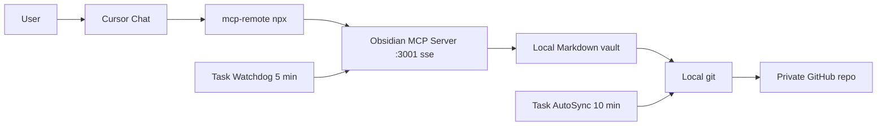

# Cursor Memory with Obsidian MCP

> Idiomas: **English** | [Español](./README.md)

A simple pattern that gives Cursor persistent, organized, cross-device memory using Obsidian MCP and a private GitHub repository.

> This repo contains **only the prompt** and **the guide**. It does not ship scripts: the Cursor agent generates them locally on your machine by following the prompt, because every install is different and each user should own their own copy.

---

## TL;DR

1. Create a private repository for your vault (e.g. `cursor-memory-vault`).
2. Open a fresh chat in Cursor.
3. Paste the contents of [`PROMPT_ULTRA_COMPLETO.md`](./PROMPT_ULTRA_COMPLETO.md) into the chat.
4. Replace `<REPO_URL_PRIVADO>` with your repo's URL.
5. Let the agent do the rest.
6. Restart Cursor when it tells you to.

Estimated time if you already have Git, Node, and Cursor: **30 minutes or less**.

---

## Why this exists

Models do not remember between sessions. What looks like "memory" is prompt + rules + retrieval.

The simple, portable way to get something close to persistent memory is to externalize it into versioned Markdown files, and let Cursor read and write them through an MCP server.

| File | Purpose |
|---|---|
| `MEMORY.md` | Global, durable rules and preferences. |
| `SESSION_LOG.md` | Chronological log of decisions. |
| `PROJECTS/<project>.md` | Per-project context and decisions. |

GitHub replicates this between your devices.

---

## Architecture

Key components:

- **Client:** Cursor Chat.
- **Bridge:** `npx -y mcp-remote http://127.0.0.1:3001/sse` (translates STDIO into SSE).
- **MCP Server:** `@smith-and-web/obsidian-mcp-server` running on `:3001`.
- **Storage:** Markdown vault on disk.
- **Sync:** git + private GitHub.
- **Resilience:** two Windows Task Scheduler tasks (watchdog + autosync).

See [`docs/adr/`](./docs/adr/) for the reasoning behind each design choice.

---

## How the prompt is used

The prompt in this repo is designed so the **Cursor agent does the heavy lifting on your machine**. That includes:

- creating the PowerShell scripts your PC needs,
- generating `mcp.json` with the correct configuration,
- registering the scheduled tasks in hidden mode,
- generating the User Rules ready to paste,
- validating that everything works end to end.

The user only provides:

- the URL of the private vault repository,
- one-off authorizations if the system asks for them.

---

## Quick verification (the agent runs this)

The prompt itself forces the agent to:

- run a health check against the local MCP endpoint,
- query the scheduled tasks,
- run a manual sync as a test,
- give you a structured report at the end.

After restarting Cursor you can manually try:

- `Use obsidian-memory and read MEMORY.md`,
- `Add a test line to SESSION_LOG.md`.

If the agent replies correctly, the install is good.

---

## Repository structure

| Path | Purpose | Audience |
|---|---|---|
| [`README.md`](./README.md) / [`README.en.md`](./README.en.md) | Onboarding (ES / EN). | Human |
| [`PROMPT_ULTRA_COMPLETO.md`](./PROMPT_ULTRA_COMPLETO.md) | The operational brief. Paste into Cursor; the agent does the rest. | AI agent |
| [`AGENTS.md`](./AGENTS.md) | Machine-readable repo map. | AI agent |
| [`manifest.json`](./manifest.json) / [`schema.json`](./schema.json) | Structured metadata + its schema. | Tooling |
| [`docs/`](./docs/) | ADRs, troubleshooting, FAQ, glossary, comparison. | Anyone |
| [`examples/`](./examples/) | Sample vault content. | Human |
| [`CHANGELOG.md`](./CHANGELOG.md) | Versioned history (Keep a Changelog). | Anyone |
| [`CONTRIBUTING.md`](./CONTRIBUTING.md) / [`SECURITY.md`](./SECURITY.md) / [`CODE_OF_CONDUCT.md`](./CODE_OF_CONDUCT.md) | Community files. | Contributors |
| [`LICENSE`](./LICENSE) | MIT. | Legal |

Intentionally minimal at the root. Zero scripts: the agent materializes them on your PC.

---

## Supported platforms

| Component | Version |
|---|---|
| OS | Windows 10, Windows 11 |
| PowerShell | 5.1, 7.x |
| Node | 18.x LTS, 20.x LTS, 22.x LTS |
| Cursor | >= 0.45 |
| `@smith-and-web/obsidian-mcp-server` | `^0.1.0` |

macOS and Linux variants are tracked in [ADR-0007](./docs/adr/0007-windows-first-pattern.md); they are not in this repo yet.

---

## Security

- Use a **private** repository for your vault.
- Never store secrets, tokens, or credentials in Markdown.
- If you paste a token into the chat by mistake, **revoke it immediately**.
- Keep `2FA` on for GitHub.

For vulnerability reports, see [`SECURITY.md`](./SECURITY.md).

---

## License

MIT. See [`LICENSE`](./LICENSE).
