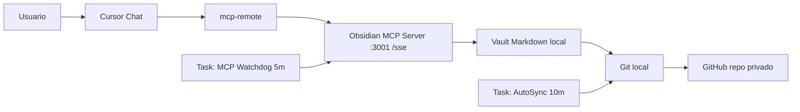

# Cursor Memory in 30 Minutes (Windows)

Este repo queda intencionalmente minimalista: solo lo necesario para integrar memoria persistente en Cursor con Obsidian MCP + GitHub.

## TL;DR (1 pantalla)

1. Crea un repo privado para `cursor-memory-vault`.
2. Abre chat en Cursor y pega `PROMPT_ULTRA_COMPLETO.md`.
3. Reemplaza `<REPO_URL_PRIVADO>`.
4. Deja que el agente configure todo.
5. Reinicia Cursor.
6. Verifica:

```powershell
powershell -ExecutionPolicy Bypass -File ".\scripts\windows\Doctor.ps1"
```

Si sale en verde, ya quedó.

## Que hace

- conecta Cursor a `obsidian-memory` via `mcp-remote`;
- levanta/revive el servidor MCP local automaticamente;
- sincroniza tu vault a GitHub cada 10 minutos;
- deja memoria global y por proyecto en Markdown.

## Tiempo estimado

Si ya tienes Git + Node + Cursor, se hace en **30 minutos o menos**.

## Por que funciona

Los modelos no guardan memoria infinita entre sesiones.  
Este sistema mueve la memoria a archivos Markdown versionados en Git:

- `MEMORY.md`: reglas/preferencias globales;
- `SESSION_LOG.md`: bitacora de decisiones;
- `PROJECTS/*.md`: contexto por proyecto.

Cursor consulta/actualiza esos archivos via MCP, y GitHub los replica entre dispositivos.

## Unico flujo recomendado (IA hace el trabajo pesado)

1. Crea un repo privado para tu vault (ejemplo: `cursor-memory-vault`).
2. Abre un chat nuevo en Cursor.
3. Pega el contenido de `PROMPT_ULTRA_COMPLETO.md`.
4. Reemplaza solo `<REPO_URL_PRIVADO>` por tu URL.
5. Deja que el agente ejecute todo (setup, watchdog, autosync, validaciones).
6. Reinicia Cursor cuando te lo indique.

El usuario solo da 2 cosas:
- la URL del repo privado;
- confirmaciones puntuales si el sistema pide permisos.

## Flujo de instalacion (una sola vez por equipo)

1. Usuario crea repo privado del vault.
2. Usuario pega `PROMPT_ULTRA_COMPLETO.md` en un chat de Cursor.
3. El agente:
   - clona/actualiza vault local,
   - configura `%USERPROFILE%\.cursor\mcp.json`,
   - activa watchdog MCP (cada 5 min),
   - activa auto-sync git (cada 10 min),
   - corre diagnóstico final.
4. Usuario reinicia Cursor.

## Flujo diario (ya operativo)

1. Cursor usa `obsidian-memory` para leer contexto del vault.
2. El agente escribe checkpoints y cierres de tarea en Markdown.
3. `CursorMemoryAutoSync` hace push automático a GitHub.
4. En otra máquina, el mismo setup recupera esa memoria.

## Scripts (los usa el agente automaticamente)

- `scripts/windows/Setup-Cursor-Memory.cmd`
 - Opcion manual de respaldo si no quieres usar el prompt.
- `scripts/windows/Setup-Cursor-Memory.ps1`
  - Setup completo por consola o automatización.
- `scripts/windows/Sync-Memory.ps1`
  - Forzar sync inmediato (sin esperar 10 minutos).
- `scripts/windows/Ensure-ObsidianMCP.ps1`
  - Levanta MCP si está caído.
- `scripts/windows/Enable-MCP-Watchdog.ps1`
  - Crea/repara watchdog cada 5 minutos.
- `scripts/windows/Enable-AutoSync.ps1`
  - Crea/repara auto-sync cada 10 minutos.
- `scripts/windows/Doctor.ps1`
  - Diagnóstico rápido end-to-end.

## Como funciona internamente

1. Cursor lee `%USERPROFILE%\.cursor\mcp.json`.
2. Ahí se registra `obsidian-memory` usando `mcp-remote`.
3. `mcp-remote` apunta a `http://127.0.0.1:3001/sse`.
4. El servidor Obsidian MCP lee/escribe tu vault en disco.
5. Scheduler:
   - `CursorObsidianMcpWatchdog` mantiene MCP arriba.
   - `CursorMemoryAutoSync` sincroniza git automáticamente.

## Mapa de flujo (comunicación)



Lectura/escritura de memoria:
- Cursor pide contexto -> MCP -> vault.
- Agente guarda cambios -> vault -> git -> GitHub.

## Alcance del repo (sin extras)

Este repo solo mantiene:
- prompt ultra completo para que el agente haga el trabajo pesado;
- scripts Windows necesarios para setup, operación y diagnóstico;
- explicación breve de flujo y funcionamiento.

## Verificación rápida

```powershell
powershell -ExecutionPolicy Bypass -File ".\scripts\windows\Doctor.ps1"
```

En Cursor, prueba:

- `Usa obsidian-memory y lee MEMORY.md`
- `Agrega una linea de prueba en SESSION_LOG.md`

Si eso funciona, ya quedó.
