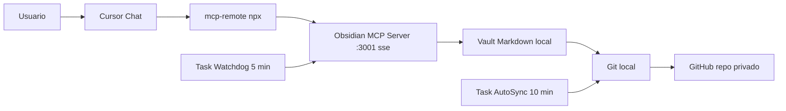

# Cursor Memory with Obsidian MCP

Un patrón simple para darle a Cursor memoria persistente, organizada y compartida entre dispositivos, usando Obsidian MCP y un repo privado de GitHub.

> Este repo solo contiene **el prompt** y **la guía**. No incluye scripts: el agente de Cursor los genera localmente en tu PC siguiendo el prompt, porque cada instalación es distinta y conviene que cada quien tenga los suyos.

---

## TL;DR

1. Crea un repo privado para tu vault (ejemplo `cursor-memory-vault`).
2. Abre un chat nuevo en Cursor.
3. Pega el contenido de [`PROMPT_ULTRA_COMPLETO.md`](./PROMPT_ULTRA_COMPLETO.md).
4. Reemplaza `<REPO_URL_PRIVADO>` por la URL de tu repo.
5. Deja que el agente haga el resto.
6. Reinicia Cursor cuando te lo indique.

Tiempo estimado si ya tienes Git, Node y Cursor: **30 minutos o menos**.

---

## Por qué existe esto

Los modelos no recuerdan entre sesiones. Lo que parece "memoria" es prompt + reglas + retrieval.

La forma sencilla y portable de tener algo cercano a memoria persistente es externalizarla en archivos Markdown versionados, y dejar que Cursor los lea/escriba a través de un servidor MCP.

| Archivo | Para qué |
|---|---|
| `MEMORY.md` | Reglas y preferencias globales duraderas. |
| `SESSION_LOG.md` | Bitácora cronológica de decisiones. |
| `PROJECTS/<proyecto>.md` | Contexto y decisiones por proyecto. |

GitHub se encarga de replicar esto entre tus dispositivos.

---

## Arquitectura



Componentes clave:

- **Cliente**: Cursor Chat.
- **Puente**: `npx -y mcp-remote http://127.0.0.1:3001/sse` (transforma STDIO en SSE).
- **Servidor MCP**: paquete `@smith-and-web/obsidian-mcp-server` corriendo en `:3001`.
- **Storage**: vault Markdown en disco.
- **Sync**: git + GitHub privado.
- **Resiliencia**: dos tareas de Windows Task Scheduler (watchdog + auto-sync).

---

## Cómo se usa el prompt

El prompt en este repo está pensado para que el **agente de Cursor haga el trabajo pesado por ti** en tu propia máquina. Eso incluye:

- crear los scripts PowerShell que necesite tu PC;
- generar `mcp.json` con la configuración correcta;
- registrar las tareas programadas en modo oculto;
- generar las User Rules listas para pegar;
- validar que todo quede funcionando end-to-end.

El usuario solo aporta:

- la URL del repo privado del vault;
- autorizaciones puntuales si el sistema las pide.

---

## Verificación rápida (la hace el agente)

El propio prompt obliga al agente a:

- correr un health check al endpoint MCP local;
- consultar las tareas programadas;
- ejecutar un sync manual de prueba;
- entregarte un reporte estructurado al final.

Tras reiniciar Cursor puedes probar manualmente:

- `Usa obsidian-memory y lee MEMORY.md`
- `Agrega una linea de prueba en SESSION_LOG.md`

Si responde correctamente, ya quedó funcional.

---

## Por qué no hay scripts en este repo

Cada instalación tiene rutas, usuarios, permisos y versiones distintas. En la práctica:

- los scripts conviene que vivan **dentro de tu vault privado**, no en este repo público;
- el agente sabe generarlos correctamente con el contexto y los gotchas reales del prompt;
- así evitas mantener scripts genéricos que pueden romperse en otra máquina.

Si quieres ver el contenido literal de los scripts (PowerShell, CMD, VBS), está incluido directamente en [`PROMPT_ULTRA_COMPLETO.md`](./PROMPT_ULTRA_COMPLETO.md), sección 8.

---

## Estructura del repo

```
.
├── README.md                  # esta guía
└── PROMPT_ULTRA_COMPLETO.md   # brief operativo para el agente de Cursor
```

Intencionalmente minimalista. Nada que mantener salvo el prompt y la documentación.

---

## Sistemas operativos

Este patrón está diseñado y probado en **Windows**. La idea es portable a Linux y macOS sustituyendo:

- `Task Scheduler` por `cron` o `launchd`;
- `wscript+vbs` por `nohup`/`launchctl`;
- rutas `%USERPROFILE%` por `$HOME`.

El prompt actual asume Windows. Si quieres otra plataforma, adáptalo o pídele al agente que lo traduzca.

---

## Seguridad

- usa repositorios **privados** para tu vault;
- nunca guardes secretos, tokens o credenciales en Markdown;
- si compartes un token por error, **revócalo inmediatamente**;
- mantén `2FA` activo en GitHub.

---

## Licencia

MIT.
