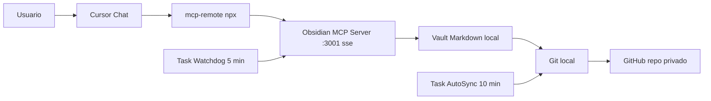

# Cursor Memory with Obsidian MCP

> Idiomas: **Español** | [English](./README.en.md)

Un patrón simple para darle a Cursor memoria persistente, organizada y compartida entre dispositivos, usando Obsidian MCP y un repo privado de GitHub.

> Este repo solo contiene **el prompt** y **la guía**. No incluye scripts: el agente de Cursor los genera localmente en tu PC siguiendo el prompt, porque cada instalación es distinta y conviene que cada quien tenga los suyos.

---

## TL;DR

1. Crea un repo privado para tu vault (ejemplo `cursor-memory-vault`).
2. Abre un chat nuevo en Cursor.
3. Pega el contenido de [`PROMPT_ULTRA_COMPLETO.md`](./PROMPT_ULTRA_COMPLETO.md).
4. Reemplaza `<REPO_URL_PRIVADO>` por la URL de tu repo.
5. Deja que el agente haga el resto.
6. Reinicia Cursor cuando te lo indique.

Tiempo estimado si ya tienes Git, Node y Cursor: **30 minutos o menos**.

---

## Por qué existe esto

Los modelos no recuerdan entre sesiones. Lo que parece "memoria" es prompt + reglas + retrieval.

La forma sencilla y portable de tener algo cercano a memoria persistente es externalizarla en archivos Markdown versionados, y dejar que Cursor los lea/escriba a través de un servidor MCP.

| Archivo | Para qué |
|---|---|
| `MEMORY.md` | Reglas y preferencias globales duraderas. |
| `SESSION_LOG.md` | Bitácora cronológica de decisiones. |
| `PROJECTS/<proyecto>.md` | Contexto y decisiones por proyecto. |

GitHub se encarga de replicar esto entre tus dispositivos.

Si quieres saber por qué este patrón vs. la memoria built-in de Cursor, mem0, Letta o un RAG propio: [`docs/comparison.md`](./docs/comparison.md).

---

## Arquitectura

Componentes clave:

- **Cliente**: Cursor Chat.
- **Puente**: `npx -y mcp-remote http://127.0.0.1:3001/sse` (transforma STDIO en SSE).
- **Servidor MCP**: paquete `@smith-and-web/obsidian-mcp-server` corriendo en `:3001` (pineado a `^0.1.0`).
- **Storage**: vault Markdown en disco.
- **Sync**: git + GitHub privado.
- **Resiliencia**: dos tareas de Windows Task Scheduler (watchdog + auto-sync).

El "por qué" de cada decisión vive en [`docs/adr/`](./docs/adr/).

---

## Cómo se usa el prompt

El prompt en este repo está pensado para que el **agente de Cursor haga el trabajo pesado por ti** en tu propia máquina. Eso incluye:

- crear los scripts PowerShell que necesite tu PC;
- generar `mcp.json` con la configuración correcta (fusionando con MCP servers ya existentes);
- registrar las tareas programadas en modo oculto;
- generar las User Rules listas para pegar;
- validar que todo quede funcionando end-to-end.

El usuario solo aporta:

- la URL del repo privado del vault;
- autorizaciones puntuales si el sistema las pide.

---

## Verificación rápida (la hace el agente)

El propio prompt obliga al agente a:

- correr un health check al endpoint MCP local;
- consultar las tareas programadas;
- ejecutar un sync manual de prueba;
- entregarte un reporte estructurado al final.

Tras reiniciar Cursor puedes probar manualmente:

- `Usa obsidian-memory y lee MEMORY.md`
- `Agrega una linea de prueba en SESSION_LOG.md`

Si responde correctamente, ya quedó funcional. Si algo falla, [`docs/troubleshooting.md`](./docs/troubleshooting.md) tiene cada error conocido con su fix.

---

## Por qué no hay scripts en este repo

Cada instalación tiene rutas, usuarios, permisos y versiones distintas. En la práctica:

- los scripts conviene que vivan **dentro de tu vault privado**, no en este repo público;
- el agente sabe generarlos correctamente con el contexto y los gotchas reales del prompt;
- así evitas mantener scripts genéricos que pueden romperse en otra máquina.

Si quieres ver el contenido literal de los scripts (PowerShell, CMD, VBS), está incluido directamente en [`PROMPT_ULTRA_COMPLETO.md`](./PROMPT_ULTRA_COMPLETO.md), sección 8. La motivación completa de esta postura está en [ADR-0006](./docs/adr/0006-no-runnable-scripts-in-this-repo.md).

---

## Estructura del repo

| Ruta | Para qué | Audiencia |
|---|---|---|
| [`README.md`](./README.md) / [`README.en.md`](./README.en.md) | Esta guía (ES / EN). | Humano |
| [`PROMPT_ULTRA_COMPLETO.md`](./PROMPT_ULTRA_COMPLETO.md) | Brief operativo. Lo pegas en chat de Cursor y el agente hace todo. | Agente IA |
| [`AGENTS.md`](./AGENTS.md) | Mapa machine-readable del repo. | Agente IA |
| [`manifest.json`](./manifest.json) / [`schema.json`](./schema.json) | Metadata estructurada y su schema. | Programático |
| [`docs/`](./docs/) | ADRs, troubleshooting, FAQ, glosario, comparación. | Cualquiera |
| [`examples/`](./examples/) | Vault de muestra (MEMORY.md, SESSION_LOG.md, PROJECTS/). | Humano |
| [`CHANGELOG.md`](./CHANGELOG.md) | Historial versionado (Keep a Changelog). | Cualquiera |
| [`CONTRIBUTING.md`](./CONTRIBUTING.md) / [`SECURITY.md`](./SECURITY.md) / [`CODE_OF_CONDUCT.md`](./CODE_OF_CONDUCT.md) | Archivos de comunidad. | Contribuidores |
| [`LICENSE`](./LICENSE) | MIT. | Legal |
| `.github/` | Templates de issues / PRs, workflows de CI. | Mantenedores |

Intencionalmente minimalista en la raíz. Cero scripts: el agente los genera en tu PC siguiendo el prompt.

---

## Plataformas soportadas

| Componente | Versión |
|---|---|
| OS | Windows 10, Windows 11 |
| PowerShell | 5.1, 7.x |
| Node | 18.x LTS, 20.x LTS, 22.x LTS |
| Cursor | >= 0.45 |
| `@smith-and-web/obsidian-mcp-server` | `^0.1.0` |

Las variantes macOS y Linux se rastrean en [ADR-0007](./docs/adr/0007-windows-first-pattern.md). Aún no están en este repo.

---

## Calidad y CI

Cada PR pasa por:

- `markdownlint` sobre todos los `*.md`,
- `prettier --check` sobre `*.json`,
- validación de `manifest.json` contra `schema.json` (ajv),
- `lychee` para links,
- extracción de los bloques `powershell` de `PROMPT_ULTRA_COMPLETO.md` + `PSScriptAnalyzer`.

Ver [`.github/workflows/lint.yml`](./.github/workflows/lint.yml) y [`CONTRIBUTING.md`](./CONTRIBUTING.md).

---

## Seguridad

- Usa repositorios **privados** para tu vault.
- Nunca guardes secretos, tokens o credenciales en Markdown.
- Si compartes un token por error, **revócalo inmediatamente**.
- Mantén `2FA` activo en GitHub.

Para reportar vulnerabilidades: [`SECURITY.md`](./SECURITY.md).

---

## Contribuir

Issues y PRs bienvenidos. Lee [`CONTRIBUTING.md`](./CONTRIBUTING.md) antes de abrir uno. Antes de proponer una decisión nueva, considera abrir un ADR en [`docs/adr/`](./docs/adr/).

---

## Licencia

MIT. Ver [`LICENSE`](./LICENSE).
